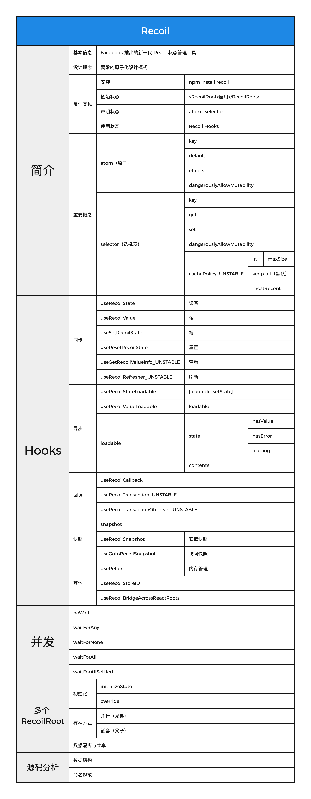

# Recoil 教程

本教程基于 Recoil 0.7.5 实现。（老规矩：内容免费，一键三连）

## 代码演示

1. 下载并安装依赖:

### `npm install`

2. 运行

### `npm run start`

### 

## 脑图文档

## 视频教程

B站： [https://space.bilibili.com/1601108355](https://space.bilibili.com/1601108355).

